# Live Drawing

서비스 주소: https://hwabang.site/

 

## Table of Contents

[1. 방구석 화방?](#1-방구석-화방)

&nbsp;&nbsp;&nbsp;&nbsp;&nbsp;&nbsp;&nbsp;&nbsp;[1) 주제 선정 배경](#1-주제-선정-배경)

&nbsp;&nbsp;&nbsp;&nbsp;&nbsp;&nbsp;&nbsp;&nbsp;[2) 서비스 정의](#2-서비스-정의)

[2. 시스템 구조도](#2-시스템-구조도)

[3. 주요 기능](#3-주요-기능)

 &nbsp;&nbsp;&nbsp;&nbsp;&nbsp;&nbsp;&nbsp;&nbsp;[1) 메인 페이지](#1-메인-페이지)

 &nbsp;&nbsp;&nbsp;&nbsp;&nbsp;&nbsp;&nbsp;&nbsp;[2) 피드백](#2-피드백)

 &nbsp;&nbsp;&nbsp;&nbsp;&nbsp;&nbsp;&nbsp;&nbsp;[3) 선생님 모드](#3-🧑‍🏫-선생님-모드 )

 &nbsp;&nbsp;&nbsp;&nbsp;&nbsp;&nbsp;&nbsp;&nbsp; &nbsp;&nbsp;&nbsp;&nbsp;&nbsp;&nbsp;&nbsp;&nbsp;[(1) 강의 생성](#1-강의-생성)

 &nbsp;&nbsp;&nbsp;&nbsp;&nbsp;&nbsp;&nbsp;&nbsp; &nbsp;&nbsp;&nbsp;&nbsp;&nbsp;&nbsp;&nbsp;&nbsp;[(2) 강의 시작 및 진행](#2-강의-시작-및-진행)

 &nbsp;&nbsp;&nbsp;&nbsp;&nbsp;&nbsp;&nbsp;&nbsp; &nbsp;&nbsp;&nbsp;&nbsp;&nbsp;&nbsp;&nbsp;&nbsp;[(3) 학생 그림 확인](#3-학생-그림-확인)

 &nbsp;&nbsp;&nbsp;&nbsp;&nbsp;&nbsp;&nbsp;&nbsp; &nbsp;&nbsp;&nbsp;&nbsp;&nbsp;&nbsp;&nbsp;&nbsp;[(4) 첨삭 모드](#4-첨삭-모드)

 &nbsp;&nbsp;&nbsp;&nbsp;&nbsp;&nbsp;&nbsp;&nbsp; &nbsp;&nbsp;&nbsp;&nbsp;&nbsp;&nbsp;&nbsp;&nbsp;[(5) 그 외 강의 도구](#5-그-외-강의-도구)

 &nbsp;&nbsp;&nbsp;&nbsp;&nbsp;&nbsp;&nbsp;&nbsp; &nbsp;&nbsp;&nbsp;&nbsp;&nbsp;&nbsp;&nbsp;&nbsp;[(6) 강의 종료](#6-강의-종료)

 &nbsp;&nbsp;&nbsp;&nbsp;&nbsp;&nbsp;&nbsp;&nbsp;[4) 학생 모드](#4-🧑‍💻-학생-모드 )

 &nbsp;&nbsp;&nbsp;&nbsp;&nbsp;&nbsp;&nbsp;&nbsp; &nbsp;&nbsp;&nbsp;&nbsp;&nbsp;&nbsp;&nbsp;&nbsp;[(1) 강의 입장](#1-강의-입장)

 &nbsp;&nbsp;&nbsp;&nbsp;&nbsp;&nbsp;&nbsp;&nbsp; &nbsp;&nbsp;&nbsp;&nbsp;&nbsp;&nbsp;&nbsp;&nbsp;[(2) 강의 수강](#2-강의-수강)

 &nbsp;&nbsp;&nbsp;&nbsp;&nbsp;&nbsp;&nbsp;&nbsp; &nbsp;&nbsp;&nbsp;&nbsp;&nbsp;&nbsp;&nbsp;&nbsp;[(3) 첨삭모드](#3-첨삭모드)

 &nbsp;&nbsp;&nbsp;&nbsp;&nbsp;&nbsp;&nbsp;&nbsp; &nbsp;&nbsp;&nbsp;&nbsp;&nbsp;&nbsp;&nbsp;&nbsp;[(4) 강의 종료](#4-강의-종료)

 

 

 

## 1. 방구석 화방?

- 방구석 화방은 라이브 드로잉 강의 공간을 제공하는 서비스 입니다.
- 드로잉 강의를 위한 실시간 드로잉, 첨삭 기능 외 다양한 기능들을 제공합니다.

 

### 1) 주제 선정 배경

> 최근 코로나로 인해 비대면 취미 시장, 특히, 드로잉 강의에 대한 수요가 급증하는 것을 확인할 수 있습니다. 하지만 기존의 사용자들이 드로잉을 배울 때, 화면을 번갈아 봐야하는 점과 선생님의 첨삭을 받을 수 없다는 점은 사용자 입장에서 상당한 불편함으로 느껴질 수 있습니다. 같은 기기의 화면에서 드로잉 강의를 수강하고 선생님께 직접 첨삭을 받을 수 있는 서비스를 제공하기 위해 실시간으로 드로잉을 배우고 첨삭받는 강의 공간을 제공하고자 했습니다.

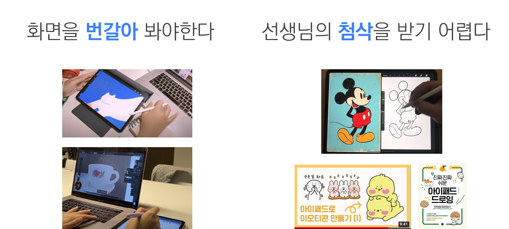

 

### 2) 서비스 정의

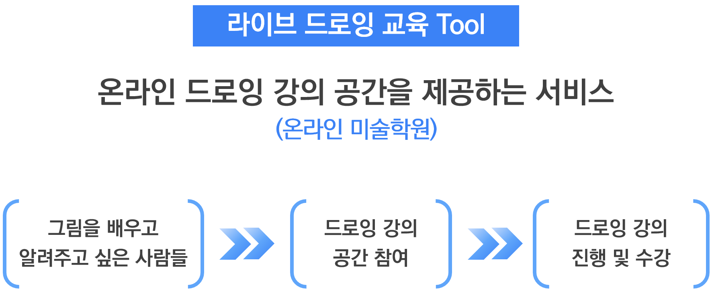

 

[⬆️ 목차로](#Table-of-Contents)

 

 

 

## 2. 시스템 구조도

 

[⬆️ 목차로](#Table-of-Contents)

 

 

 

## 3. 주요 기능

### 1) 메인 페이지

* 현재 개설 된 라이브 강의 및 참여 인원을 확인할 수 있습니다. 
* 구글 로그인을 통해 별도 회원가입 없이 간편하게 서비스를 이용할 수 있습니다. 

 

### 2) 피드백

* 서비스를 이용하면서 느꼈던 점을 남길 수 있습니다.   

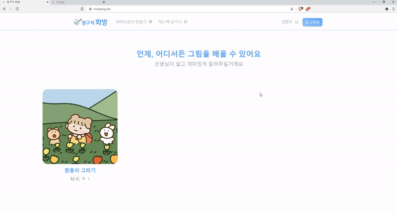

 

[⬆️ 목차로](#Table-of-Contents)

 

 

 

## 3) 🧑‍🏫 선생님 모드 

> 강의를 생성하여 학생들에게 수업을 진행할 수 있습니다.

 

#### (1) 강의 생성

- 개설하고자 하는 강의 제목과 입장 코드를 입력 하고 "강의 시작" 버튼을 누르면 강의 공간으로 이동됩니다.  

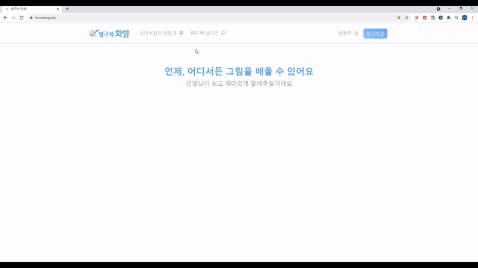

 

#### (2) 강의 시작 및 진행

- 강의 진행 방법을 확인 후 "수업시작" 버튼을 누르면 강의 모드로 전환됩니다.  

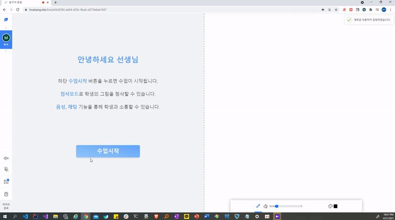

 

#### (3) 학생 그림 확인

- 학생들이 그린 그림들을 확인할 수 있습니다. 

 

#### (4) 첨삭 모드 

- 학생이 그린 그림을 복사 후 첨삭을 진행할 수 있습니다.

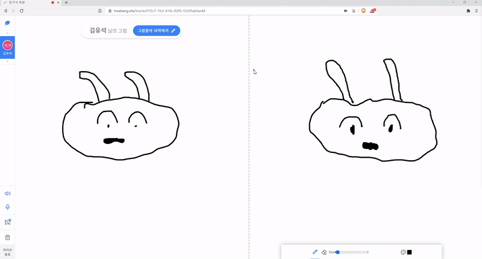

 

#### (5) 그 외 강의 도구 

* 학생들과 채팅을 통해 소통할 수 있습니다.  
* 음성 대화 및 마이크, 스피커 on/off 기능을 지원합니다. 
* 현재까지 그린 그림을 삭제할 수 있습니다. (본인의 그림 한정)

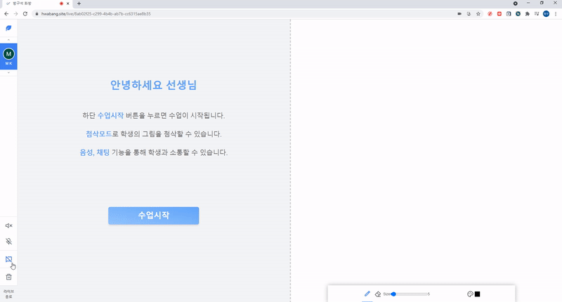

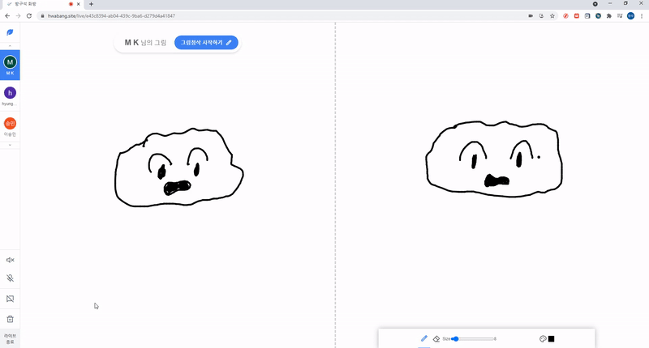

 

#### (6) 강의 종료 

* 수업을 마치면, 라이브 강의를 종료할 수 있습니다. 

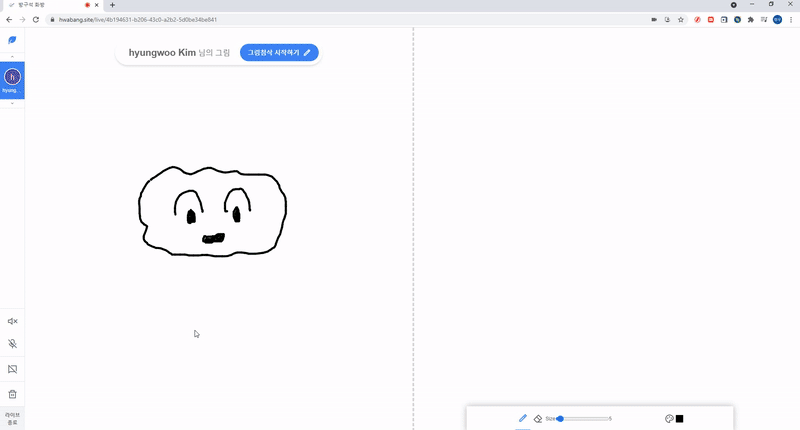

 

[⬆️ 목차로](#Table-of-Contents)

 

 

 

## 4) 🧑‍💻 학생 모드

> 학생으로 수업에 참여하여 선생님에게 그림을 배울 수 있습니다.

 

#### (1) 강의 입장

* 개설 된 라이브 강의 중 수강하고 싶은 강의를 선택합니다.
* 입장 코드가 일치할 경우, 해당 강의에 입장할 수 있습니다.
* 강의 시작 전까지, 서비스 사용 방법 확인 및 드로잉을 연습하며 대기합니다.  

 

#### (2) 강의 수강

* 강의가 시작되면, 왼쪽의 선생님의 그림을 보며 드로잉을 공부합니다.   

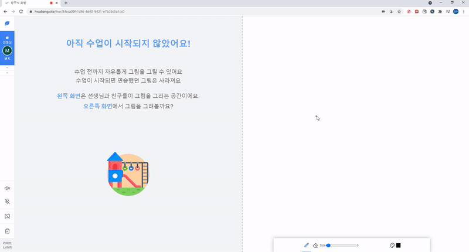

 

#### (3) 첨삭모드

* 선생님께서 내 그림을 복사하여 첨삭하는 과정을 확인할 수 있습니다. 

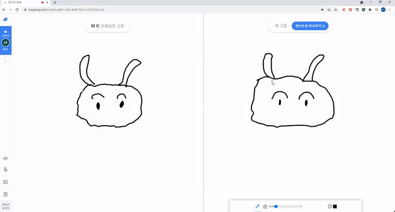

 

* 첨삭이 종료되면, 첨삭 전/후의 그림을 비교해볼 수 있습니다. 

 

#### (4) 강의 종료

* 강의가 종료되면, 강의 종료 메시지와 함께 메인페이지로 이동됩니다.  

 

[⬆️ 목차로](#Table-of-Contents)

 

 

 