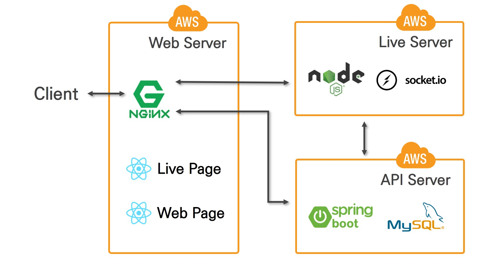
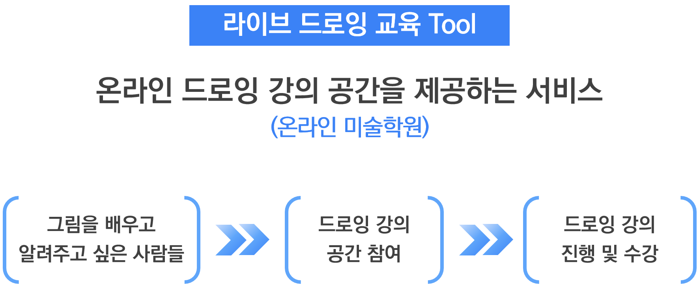
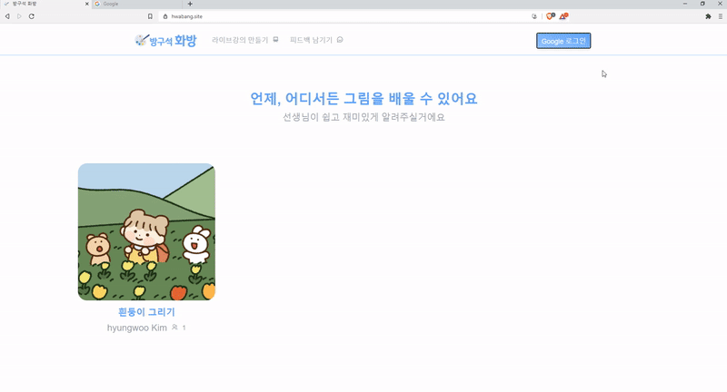
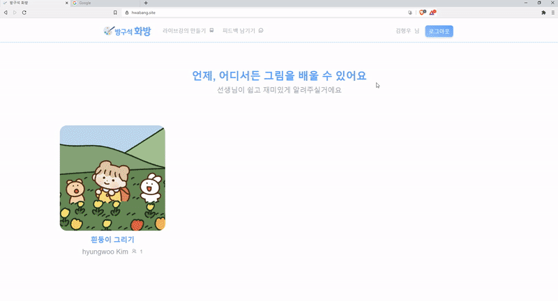

# Live Drawing

서비스 주소: https://hwabang.site/

Table of Contents
-----------------

[1. 역할 및 기술](#1-역할-및-기술)

[2. TamTamLens?](#2-TamTamLens)

​    [1) 추진 배경](#1-추진-배경)

​    [2) TamTamLens 서비스 흐름도](#2-TamTamLens-서비스-흐름도)

[3. 주요기능](#3-주요기능)

​    [1) 서비스 소개 페이지](#1-서비스-소개-페이지)

​    [2) 로그인](#2-로그인)

​    [3) 메인페이지](#3-메인페이지)

​    [4) 채널페이지](#4-채널페이지)

​    [5) 동영상 재생 페이지](#5-동영상-재생-페이지)

​    [6) 내 기업 페이지](#6-내-기업-페이지)

​    [7) 마이페이지](7-마이페이지)

## 시스템 구조도

 

[:arrow_up:목차로](#Table-of-Contents)

 

 

 

## 2. 방구석 화방?

- 방구석 화방은 라이브 드로잉 강의 공간을 제공하는 서비스 입니다. 
- 드로잉 강의를 위한 실시간 드로잉, 첨삭 기능 외 다양한 기능들을 제공합니다.

 

### 1) 주제 선정 배경

>최근 코로나로 인해 비대면 취미 시장, 특히, 드로잉 강의에 대한 수요가 급증하는 것을 확인할 수 있습니다. 하지만 기존의 사용자들이 드로잉을 배울 때, 화면을 번갈아 봐야하는 점과 선생님의 첨삭을 받을 수 없다는 점은 사용자 입장에서 상당한 불편함으로 느껴질 수 있습니다. 같은 기기의 화면에서 드로잉 강의를 수강하고 선생님께 직접 첨삭을 받을 수 있는 서비스를 제공하기 위해 실시간으로 드로잉을 배우고 첨삭받는 강의 공간을 제공하고자 했습니다.

### 2) 서비스 정의

## 3. 주요기능

### 1) 로그인

### 2) 방입장

### 3) 피드백

4) 

